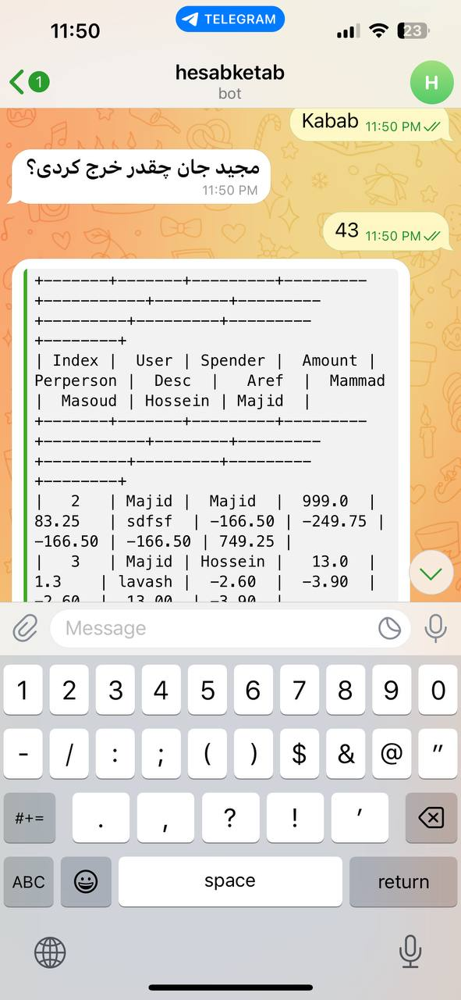

# telbot

# telbot Telegram Bot

telbot is a Telegram bot designed to help users split bills and expenses among a group of people. The bot allows users to track expenses, generate reports, and manage shared expenses efficiently.

## Features

- **Expense Tracking**: Users can record expenses, specifying the spender, amount, description, and participants.
- **Real-Time Updates**: The bot maintains real-time calculations of each participant's share and updates balances accordingly.
- **Reporting**: Users can generate detailed reports of expenses, including individual contributions, total expenses, and balances.
- **PDF Export**: Reports can be exported as PDF files for easy sharing and reference.
- **SQLite Database**: The bot utilizes an SQLite database to store expense records securely.

## Usage

1. **Start Conversation**: Initiate a conversation with the bot by sending `/start`.
2. **Record Expense**: Use the `New` command to record a new expense. Follow the prompts to specify the spender, amount, description, and participants.
3. **Delete Expense**: Use the `Delete` command to delete a previously recorded expense. Follow the prompts to select the expense to delete.
4. **Generate Report**: Use the `Report` command to generate a report of all recorded expenses. The report includes individual contributions, total expenses, and balances.
5. **Export Report**: The bot automatically generates a PDF report and sends it to the user for easy sharing.

## Installation

To run the telbot Telegram bot locally, follow these steps:

1. Clone the repository to your local machine.
2. Install the required dependencies using `pip install -r requirements.txt`.
3. Set up a Telegram bot and obtain the API token.
4. Create a `.env` file and add your Telegram bot API token:
   ```
   TOKEN=your_bot_token_here
   ```
5. Run the `main.py` script to start the bot.

## Dependencies

- `python-telegram-bot`: Python library for interacting with the Telegram Bot API.
- `prettytable`: Library for generating ASCII tables for report formatting.
- `fpdf`: Library for creating PDF files programmatically.
- `python-dotenv`: Library for loading environment variables from a .env file.

## telbot menu
<table style="width:100%">
  <tr>
    <td style="text-align:center; padding: 5px;">
      
    </td>
    <td style="text-align:center; padding: 5px;">
      
    </td>
    <td style="text-align:center; padding: 5px;">
      
    </td>
    <td style="text-align:center; padding: 5px;">
      
    </td>
  </tr>
</table>

## Sample output report in text file
```
+-------+-------+---------+---------+-----------+--------+---------+---------+---------+---------+--------+
| Index |  User | Spender |  Amount | Perperson |  Desc  |   Aref  |  Mammad |  Masoud | Hossein | Majid  |
+-------+-------+---------+---------+-----------+--------+---------+---------+---------+---------+--------+
|   2   | Majid |  Majid  |  999.0  |   83.25   | sdfsf  | -166.50 | -249.75 | -166.50 | -166.50 | 749.25 |
|   3   | Majid | Hossein |   13.0  |    1.3    | lavash |  -2.60  |  -3.90  |  -2.60  |  13.00  | -3.90  |
|   5   | Majid | Hossein |   6.32  |    0.53   |  rrrr  |  -1.05  |  -1.58  |  -1.05  |   5.27  | -1.58  |
|   6   | Majid |  Majid  |   43.0  |    3.58   | Kabab  |  -7.17  |  -10.75 |  -7.17  |  -7.17  | 32.25  |
+-------+-------+---------+---------+-----------+--------+---------+---------+---------+---------+--------+
|   -   |   -   |  total  | 1061.32 |   88.66   |   -    |  -177.3 |  -266.0 |  -177.3 |  -155.4 | 776.0  |
+-------+-------+---------+---------+-----------+--------+---------+---------+---------+---------+--------+

```